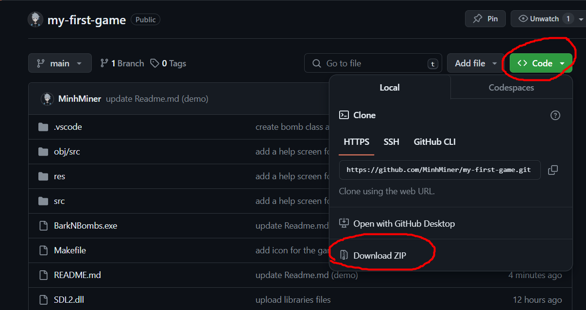
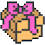
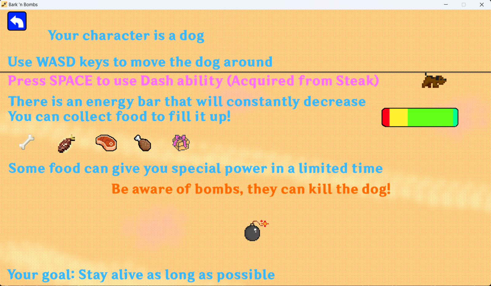

# Bark 'n Bombs

- Thử nghiệm game: [Đang cập nhật](https://youtu.be/???)

# Giới thiệu game

Bark 'n Bombs là một tựa game thuộc thể loại Retro/Arcade Game. Người chơi sẽ điều khiển nhân vật là một con chó di chuyển xung quanh màn hình trò chơi. Trên màn hình sẽ có các chướng ngại vật cản đường, những quả bom được sinh ra ngẫu nhiên mà người chơi cần né tránh, các loại thức ăn khác nhau mà người chơi có thể thu thập để tăng điểm số của mình. Mục tiêu của trò chơi là điều khiển nhân vật sống càng lâu càng tốt!

- [0. Cách tải game](#0-cách-tải-game)
- [1. Bắt đầu game](#1-bắt-đầu-game)
- [2. Chọn bản đồ chơi](#2-chọn-bản-đồ-chơi)
- [3. Các thành phần trong game:](#3-các-thành-phần-trong-game)
- [4. Hướng dẫn chơi](#4-hướng-dẫn-chơi)
- [5. Kết thúc trò chơi và điểm cao](#5-kết-thúc-trò-chơi-và-điểm-cao)
- [Về source code game](#về-source-code-game)

# 0. Cách tải game

Tải repository (được nén thành .zip) này về. 
Giải nén repository vào một thư mục và chạy file BarkNBombs.exe để bắt đầu chơi. 

File BarkNBombs.exe được build bằng compiler mingw trên máy cá nhân của mình, chưa được thử nghiệm trên các máy khác. Nếu gặp lỗi không chạy được file, bạn có thể tự build project game này bằng mã nguồn đã được cung cấp. 

- Tất cả code đều nằm trong thư mục src. 

# 1. Bắt đầu game

Sau khi chạy game thành công, màn hình game gồm có tiêu đề, các nút bấm gồm Start (Bắt đầu chơi), Select Map (Chọn bản đồ chơi), Best score (Kỷ lục điểm cao nhất lưu trên máy) và một nút dấu chấm hỏi ở góc trên bên trái màn hình trò chơi.

Khi đưa chuột vào một nút bất kỳ, nút đó sẽ sáng lên.

Để bắt đầu chơi ngay lập tức, đưa chuột vào nút bấm Start và click chuột trái. Trò chơi sẽ được bắt đầu với bản đồ mặc định (Bản đồ thứ nhất - Map 1).

Nếu người chơi bấm nút Select Map, game chuyển sang màn hình chọn bản đồ chơi.
- [2. Chọn bản đồ chơi](#2-chọn-bản-đồ-chơi)

Nếu người chơi bấm nút Best score, game chuyển sang màn hình hiển thị điểm số cao nhất của tất cả các bản đồ chơi được lưu trên máy tính.
- [5. Kết thúc trò chơi và điểm cao](#5-kết-thúc-trò-chơi-và-điểm-cao)

Nếu người chơi bấm nút dấu chấm hỏi ở trên góc trái màn hình, game chuyển sang màn hình hướng dẫn chơi.
- [4. Hướng dẫn chơi](#4-hướng-dẫn-chơi)

# 2. Chọn bản đồ chơi

Có tổng cộng 4 bản đồ chơi khác nhau và bạn có thể chọn bất kỳ bản đồ nào tùy thích. Để chọn bản đồ chơi, nhấn nút Select map ở màn hình tiêu đề trò chơi.

Đưa chuột đến bản đồ chơi mà mình mong muốn. Bản đồ đó sẽ sáng lên như những nút bấm khác. Click chuột trái để chọn bản đồ và bắt đầu chơi.

# 3. Các thành phần trong game:

-    Chó (Người chơi) 
     : đây là nhân vật mà người chơi sẽ điều khiển

-    Thanh năng lượng 
     : thanh năng lượng của người chơi sẽ liên tục giảm dần, nếu người chơi để thanh năng lượng giảm xuống cạn thì trò chơi sẽ kết thúc. Người chơi cần thu thập các vật phẩm thức ăn để hồi điểm năng lượng (Tối đa thanh năng lượng: 15000 điểm)

- Hiệu ứng: Người chơi có thể thu thập các hiệu ứng này để thay đổi một số thuộc tính của nhân vật chú chó. Các biểu tượng của hiệu ứng xuất hiện ở bên trái thanh năng lượng và biến mất dần tượng trưng cho khoảng thời gian hiệu ứng còn tồn tại.
    * Tăng tốc  : Tăng tốc độ di chuyển của nhân vật trong một khoảng thời gian.
    * Khiên  : Bảo vệ nhân vật khỏi một quả bom. Khiên sẽ bị tiêu thụ sau khi nhân vật "đỡ" một quả bom nên hãy cẩn thận khi ở gần nhiều quả bom cùng một lúc.
    * Né (Dash)  : Khi kích hoạt kỹ năng né bằng nút SPACE trên bàn phím, nhân vật được đột ngột tăng tốc độ di chuyển lên rất cao và nhận hiệu ứng bất tử trong khoảng thời gian cực ngắn. Nếu sử dụng tốt, kỹ năng này rất hữu ích để thoát hiểm trong những tình huống bất ngờ. Kỹ năng được tiêu thụ sau khi sử dụng.

- Tường  : Chướng ngại vật chặn đường người chơi di chuyển. Ở mỗi bản đồ thì tường được bố trí với các bố cục khác nhau. Chúng đứng yên một chỗ và ngăn người chơi đi qua, cũng như ngăn chặn bom và các vật phẩm khác xuất hiện ở vị trí đó.

- Bom  : Bom sẽ xuất hiện ngẫu nhiên trên bản đồ chơi sau những khoảng thời gian nhất định, và chúng sẽ tự động phát nổ sau 0,75s

- Thức ăn/Vật phẩm : Chúng được sinh ra ngẫu nhiên trên bản đồ sau những khoảng thời gian nhất định. Người chơi điều khiển nhân vật lại gần để thu thập

|                                                                             | Tên vật phẩm    | Phần thưởng khi thu thập                                                                                                   |
|-----------------------------------------------------------------------------|--------------|------------------------------------------------------------------------------------------------------------------------------|
|   | Xương	  | Tăng 10 điểm và hồi 3500 điểm năng lượng.                                                                                              |
|     | Cá	   | Tăng 50 điểm và hồi 7000 điểm năng lượng, đồng thời nhận hiệu ứng Tăng tốc trong 2s                                                                    |
|           | Bít tết	    | Tăng 75 điểm và hồi 10000 điểm năng lượng, đồng thời nhận hiệu ứng Khiên duy trì tối đa 10s.                                                                   |
|         | Thịt gà	    | Tăng 60 điểm và hồi 8000 điểm năng lượng, đồng thời nhận được khả năng né (Dash) duy trì tối đa 30s. |
|  | Hộp quà  | Tăng 150 điểm và hồi toàn bộ thanh năng lượng.                                                               |

- Điểm (Score): Ở góc trái bên trên màn hình. Điểm được tính dựa vào số thời gian người chơi đã sống sót cùng với số lượng và loại thức ăn/vật phẩm mà người chơi đã thu thập.

- Nút tạm dừng  : ở góc phải bên trên màn hình. Bấm nút này để tạm dừng trò chơi. Bấm một lần nữa để tiếp tục.

- Bố cục game cơ bản:

 

# 4. Hướng dẫn chơi
Xem mục [3. Các thành phần trong game](#3-các-thành-phần-trong-game) để biết thêm các thông tin về thành phần trò chơi

Màn hình hướng dẫn trò chơi:

Nhiệm vụ của bạn là điều khiển nhân vật chú chó tránh khỏi những quả bom nguy hiểm và thu thập các loại vật phẩm, thức ăn để duy trì trong bản đồ chơi càng lâu càng tốt để đạt được điểm cao nhất. 
Sử dụng W, A, S, D để điều khiển nhân vật theo thứ tự đi lên trên, đi sang trái, đi xuống dưới, đi sang phải.  

Sau khi thu thập được Bít tết và nhận kỹ năng né (Dash), bạn có thể nhấn nút SPACE để kích hoạt kỹ năng này. 

- Trong màn hình hướng dẫn trò chơi, bạn có thể điều khiển nhân vật chú chó và thu thập các đồ ăn/vật phẩm. Thanh năng lượng và Bom đã tạm thời được tạm dừng và không hoạt động trong màn hình hướng dẫn trò chơi

Có thể nhất nút tạm dừng giữa ván chơi. Thời gian và điểm số cũng như bom, thức ăn và nhân vật sẽ tạm thời bất động cho đến khi trò chơi được tiếp tục bằng cách nhắn nút tạm dừng một lần nữa. 

Nếu chẳng may chú chó nằm trong khu vực bị nổ bom mà không có khiên bảo vệ hoặc thanh năng lượng đã cạn kiệt, trò chơi sẽ chuyển sang màn hình kết thúc
- [5. Kết thúc trò chơi và điểm cao](#5-kết-thúc-trò-chơi-và-điểm-cao)

# 5. Kết thúc trò chơi và điểm cao

- Khi trò chơi kết thúc, điểm số của bạn sẽ là điểm số vào thời điểm kết thúc.

- Nếu như điểm số của bạn cao hơn điểm cao nhất hiện tại được lưu trong máy, sẽ xuất hiện dòng chữ "New Record!!" thông báo đây là kỷ lục mới. Điểm số này sau đó sẽ được lưu vào kỷ lục điểm cao trên máy.

Bạn có thể bấm nút Play Again để chơi lại hoặc nút Home để về màn hình tiêu đề

Màn hình điểm cao nhất của các bản đồ chơi (Ví dụ):

- Có thể bấm nút  ở góc trên bên trái màn hình để về màn hình tiêu đề

- Lưu ý: Bấm nút  để xóa toàn bộ dữ liệu điểm cao trên máy. Hãy cẩn thận vì dữ liệu này không thể khôi phục sau khi xóa.

---

### Về source code game:

- Folder src:
    * Folder include/SDL2: Chứa các file header của thư viện SDL2
    * Folder lib: Chứa các file cần thiết của thư viện SDL2
    * main.cpp: Hàm main
    * Game.h và game.cpp: Tổng hợp phần lớn các biến và logic game
    * Utils.h: Chứa các enum và struct được dùng trong nhiều file khác của game
    * RenderWindows.h và renderwindows.cpp: chứa class RenderWindow để xử lý các vấn đề liên quan đến đồ họa, sử dụng các hàm của các thư viện SDL2, SDL2_image, SDL2_tff
    * Entity.h và entity.cpp: chứa class Entity và subclass Bomb. Class Entity là một class chung để tạo ra một số subclass khác, trong đó có Bomb là class liên quan đến thành phần Bom của game
    * Player.h và player.cpp: chứa class Player liên quan đến nhân vật người chơi điều khiển
    * Map.h: chứa class Wall liên quan đến vật thể Tường (Wall) ngăn cản sự di chuyển của người chơi trong game
    * Button.h và button.cpp: Chứa class Button liên quan đến các nút bấm trong trò chơi
- Folder res:
    * Folder dat: Lưu dữ liệu điểm số cao nhất của các bản đồ chơi. Được dùng để nạp dữ liệu khi khởi động game và được ghi dữ liệu điểm số mới (nếu có) khi tắt game
    * Folder font: Chứa font chữ để thư viện SDL2_tff sử dụng
    * Folder gfx: Chứa các file đồ họa game, phần lớn được sử dụng bởi thư viện SDL2_image
    * Folder sfx: Chứa các file âm thanh game, được sử dụng bởi thư viện SDL2_mixer
    * Folder preview: Chứa các hình ảnh được sử dụng bởi file README.md này